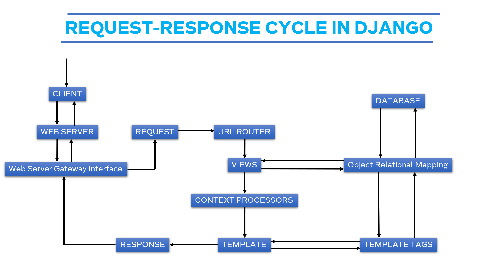

# Application Deployment Link
### main deployment: https://pbp-tugas-django.herokuapp.com/
### Katalog Page: https://pbp-tugas-django.herokuapp.com/katalog/

## Buatlah bagan yang berisi request client ke web aplikasi berbasis Django beserta responnya dan jelaskan pada bagan tersebut kaitan antara urls.py, views.py, models.py, dan berkas html

Pada saat client membuka aplikasi django maka akan terjadi proses request melalui web server dan web server gateway interface (WSGI) seperti Gunicorn. Setelah request tersebut dikirimkan maka django pertama akan melihat dari urls.py jika path tersebut ada. Jika ada maka akan dilanjutkan ke views.py dimana pada views.py akan terimplementasi fungsi-fungsi yang akan mereturn sebuah template yang akan menjadi front-end display dan sebuah dictionary object yang berisi data dari back-end yang ingin di parse ke front-end. Data dari back-end diambil dari sebuah json file yang kemudian di proses menggunakan models.py yang berisikan sebuah schema yang memetakan data dari json file tersebut ke sebuah variabel pada python. File models.py tersebut kemudian di import oleh views.py yang kemudian akan di ambil semua datanya dan di assign kedalam sebuah key pada dictionary yang menjadi data parser ke front-end. Pada front-end kita dapat menggunakan syntax dari django yang berbasiskan object relational mapping untuk mengambil data yang telah di parse oleh views.py ke tag-tag HTML yang sesuai. Setelah semua data telah tergenerate, maka template akan direturn sebagai sebuah response yang akan melalui WSGI dan web server untuk di display kepada client (Browser).

## Jelaskan kenapa menggunakan virtual environment? Apakah kita tetap dapat membuat aplikasi web berbasis Django tanpa menggunakan virtual environment?
1. Virtual environment bertujuan untuk membedakan version library yang digunakan pada suatu project dengan version global local dari library tersebut. Dengan melakukan ini, aplikasi menjadi lebih konsisten karena digunakan pada device manapun akan memiliki environment atau version library yang sama.
2. Tentunya bisa, virtual environment hanya memberikan kesempatan bagi developer untuk menciptakan kekonsistenan antar device yang akan menjalankan aplikasi tersebut. Akan tetapi selama version library global local suatu device yang ingin menjalankan apliaksi tersebut memiliki version yang sama atau version diatasnya yang tetap mensupport semua fitur pada versi sebelumnya maka aplikasi tetap akan berjalan seperti normal.

## Jelaskan bagaimana cara kamu mengimplementasikan poin 1 sampai dengan 4 di atas.
1. Pada poin satu, pertama setelah mengclone repository serta template dengan
<code>git clone https://github.com/Nicholas-Sidharta12365/assignment-2-pbp-repository</code>
dan menginstall semua dependency pada requirements.txt dengan menggunakan
<code>pip install requirements.txt</code>. Saya pertama membuat sebuah fungsi baru pada katalog/views.py yang saya namakan katalog dimana fungsi tersebut akan mengambil parameter request dan akan mereturn request tersebut, sebuah string nama file html yang ingin di display, dan sebuah variabel yang akan menjadi parser data yang nanti akan ditampilkan pada HTML. Untuk pengambilan data pertama saya mengupdate dulu schema database nya menggunakan <code>python manage.py makemigrations</code> dan <code>python manage.py migrate</code>. Kemudian, karena models.py pada katalog sudah diimplementasi maka dapat langsung saya panggil dari views.py dengan menggunakan from dan import dimana file yang dituju adalah models.py dan yang di import adalah class yang menjadi schema database. Dapat dilakukan dengan menggunakan syntax <code>from katalog.models import *</code>. Lalu untuk mendapatkan data-data yang ada pada class tersebut dapat menggunakan syntax <code>CatalogItem.objects.all()</code> yang akan di assign ke sebuah variabel. Setelah itu dapat digunakan data structure dictionary sebagai sebuah object yang nanti akan di parse ke HTML dengan berbagai data dari back-end pada tugas ini, yang perlu di parse adalah nama, id, dan data dari database. Setelah object dictionary tersebut sudah selesai, dapat di parse dictionary tersebut pada return dari fungsi tersebut. Dengan demikian data dari back-end siap digunakan pada front-end.

2. Setelah fungsi tersebut selesai maka kita perlu memastikan bahwa aplikasi utama dapat mengakses function tersebut. Hal ini dilakukan melalui katalog/urls.py dimana dapat diimplementasi urlpatterns yang akan berisi path pada aplikasi katalog itu sendiri yang kemudian akan di call oleh urls.py dari project django / aplikasi utama. Pada path di katalog/urls.py dapat digunakan views yang diimport melalui <code> from . import views </code>. Syntax tersebut berarti dari directory tersebut import file views.py.
Setelah itu, pada urls.py project_django / aplikasi utama dapat ditambahkan pada urlpatterns nya sebuah path baru (contoh pada tugas ini: katalog/) yang akan menginclude file urls.py tadi dari aplikasi katalog dengan menggunakan syntax <code> path('katalog/', include('katalog.urls'))</code>. Dari hal tersebut, koneksi dari aplikasi utama ke aplikasi katalog dapat terhubung.

3. Untuk memetakan data dari back-end tadi ke HTML, pertama saya menyelesaikan parse data untuk hal-hal kecil seperti nama dan id yang dapat langsung di parse menggunakan syntax dari django yaitu <code>{{name}}</code> dan <code>{{id}}</code>. Dimana syntax tersebut diletakan diantara tag yang sesuai seperti tag p pada HTML. Dengan name dan id bersesuaian dengan key yang ada pada dictionary object yang di parse dari views.py. Untuk data dari database dapat digunakan for loop dengan syntax dari django <code>  </code>. Dengan barang merupakan variabel iterator dan list merupakan key pada views.py yang membawa data-data dari database. Dimana diantara block for tersebut dapat ditambahkan tag HTML yang diantaranya merupakan pemanggilan variabel seperti name dan id tadi, contohnya <code>{{barang.item_nama}}</code> syntax tersebut akan mengambil value dari key yang bernama item_nama pada index yang sedang diiterasi oleh for block.

4. Untuk deployment, karena procfile dan dpl.yml sudah terimplementasi maka saya hanya tinggal membuka secrets pada github saya kemudian membuat 2 buah new secrets yaitu untuk heroku API key dan heroku app name yang sudah saya buat di heroku secara langsung. Setelah hal tersebut, maka saat aplikasi saya push ke github secara otomatis workflow akan di run oleh github dan aplikasi terdeploy pada link heroku.