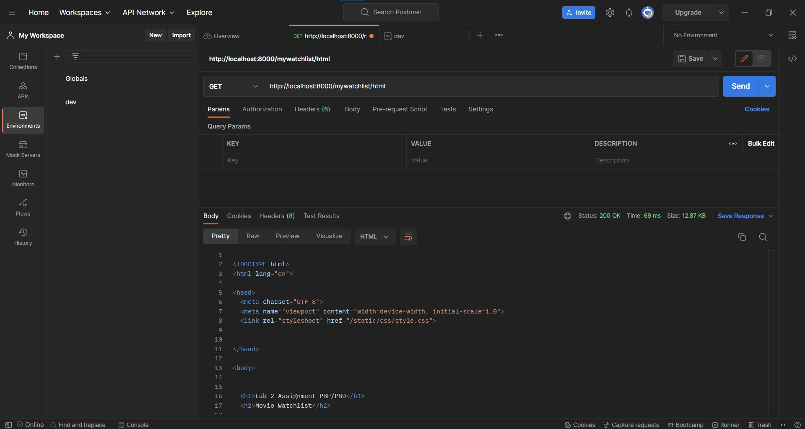
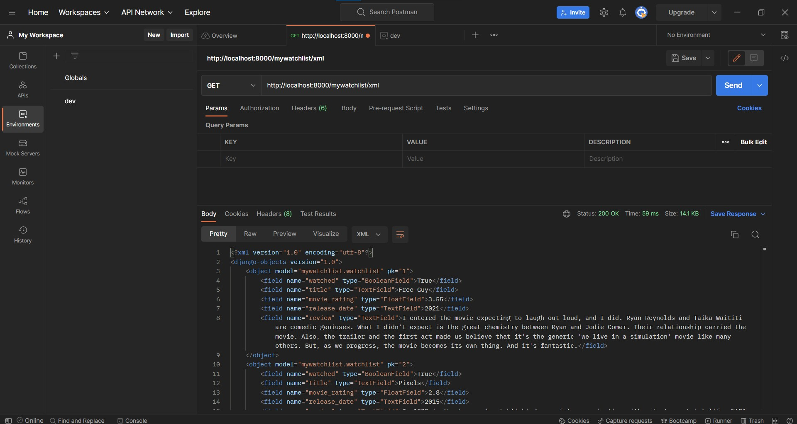
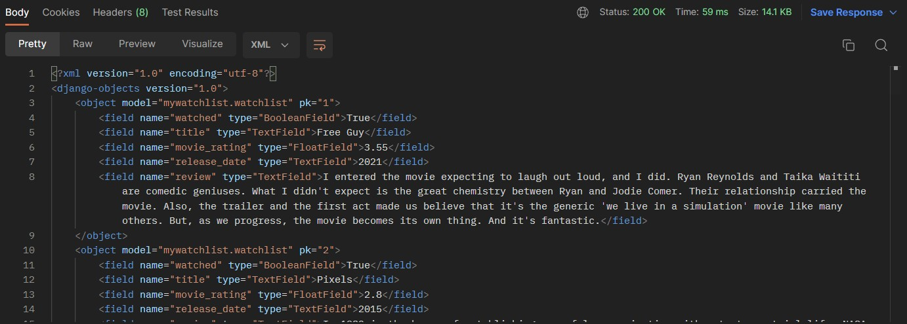
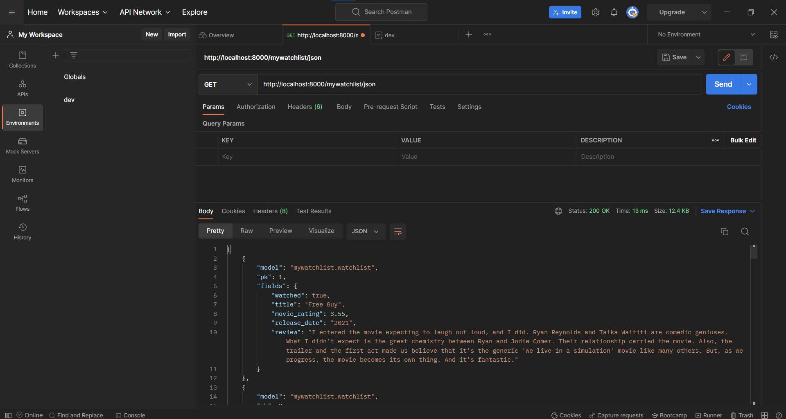
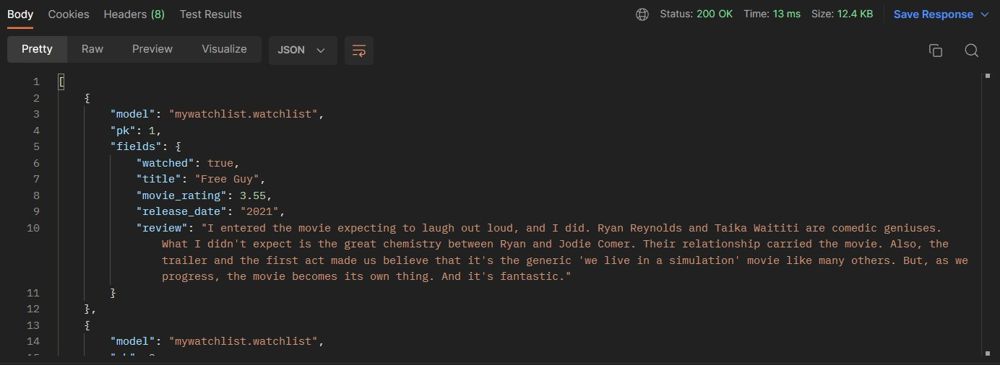

# Application Deployment Link
### main deployment: https://pbp-tugas-2-django.herokuapp.com/
### Watchlist Page (HTML): https://pbp-tugas-2-django.herokuapp.com/mywatchlist/html/
### Watchlist Page (XML): https://pbp-tugas-2-django.herokuapp.com/mywatchlist/xml/
### Watchlist Page (JSON): https://pbp-tugas-2-django.herokuapp.com/mywatchlist/json/

## Jelaskan perbedaan antara JSON, XML, dan HTML!
JSON atau JavaScript Object Notation adalah sebuah format penukaran data yang ringan dan independen. Dimana JSON dibuat berbasiskan sebuah bahasa pemrograman yang dinamakan Javascript (JS). Sedangkan XML atau Extensible markup language adalah sebuah bahasa markup yang mendefinisikan sebuah set peraturan untuk encoding agar sebuah dokumen dapat mudah dibaca untuk manusia dan mesin. XML diturunkan dari SGML atau Standard Generalized Markup Language. XML didesain untuk membawa data bukan untuk mendisplay data sehingga fokus dari XML sendiri adalah sebuah bahasa yang sederhana, general, dan kegunaannya di seluruh internet. Sedangkan HTML atau HyperText Markup Language adalah sebuah bahasa markup yang menjadi fondasi pembuatan interface sebuah platform web. Akan tetapi karena HTML bukan merupakan bahasa pemrograman maka HTML pada dasarnya statis dan perlu bantuan bahasa pemrograman lain untuk membuat sebuah platform dinamis, contohnya dengan javascript untuk fungsionalitas dan CSS (Cascading Style Sheets) untuk mendesain sebuah halaman web.

## Jelaskan mengapa kita memerlukan data delivery dalam pengimplementasian sebuah platform?
Data delivery sangat penting pada pengimplementasian sebuah platform karena tanpa adanya data delivery maka suatu platform akan menjadi statik dan tidak berguna untuk apapun selain sebagai sebuah interface. Selain itu, tanpa adanya data delivery maka semua data harus diketik secara statis atau dalam kata lain setiap hal yang ingin dimunculkan pada suatu platform harus diketik secara manual oleh developer untuk dapat muncul pada platform tersebut.

## Jelaskan bagaimana cara kamu mengimplementasikan poin 1 sampai dengan 3 di atas.
1. Membuat suatu aplikasi baru bernama mywatchlist di proyek Django Tugas 2 pekan lalu

Pertama membuat aplikasi django baru menggunakan 
```
python manage.py startapp mywatchlist
```
Selanjutnya menambahkan file urls.py pada folder mywatchlist, directory fixtures dan mengisinya dengan file json bernama initial_watchlist_data.json sebagai database dari aplikasi mywatchlist, directory templates yang diisi oleh mywatchlist.html yang akan menjadi interface user.

2. Menambahkan path mywatchlist sehingga pengguna dapat mengakses http://localhost:8000/mywatchlist

Untuk menambahkan path watchlist dari domain maka pada urls.py dimasukan
```
from django.urls import path, include
from . import views
urlpatterns= {
}
```
Kode tersebut merupakan template default bagi urls.py dimana diperlukan beberapa import seperti path dan include yang akan digunakan sebagai router, dan mengimport views. Serta sebuah set yaitu urlpatterns yang akan menjadi container bagi semua routes nanti. Agar user dapat mengakses ~/watchlist maka perlu diimplementasi pada project_django pada urls.py dengan 
```
path('mywatchlist/', include('mywatchlist.urls')), 
```
serta menambahkan mywatchlist sebagai installed pada settings.py pada project_django. Untuk dapat mendisplay content dari mywatchlist maka ditambahkan pada urlpatterns pada urls.py mywatchlist sebuah path yang diimplementasikan sebagai 
```
path('', views.mywatchlist, name="mywatchlist"),
``` 
dimana mywatchlist pada path akan menjadi fungsi display html dari aplikasi mywatchlist. Kemudian agar dapat diakses file html dari mywatchlist, maka pada views.py mywatchlist diimplementasikan 
```
from django.shortcuts import render

def mywatchlist(request):

    return render(request, 'mywatchlist.html')
```

Pada views.py diperlukan sebuah import yaitu untuk render dimana render akan mengembalikan html yang akan di display oleh django nantinya. File html pada directory template bernama mywatchlist.html, maka secara langsung parameter return untuk file html nya adalah mywatchlist.html. Setelah hal-hal tersebut sudah terimplementasi maka setelah
```
python manage.py runserver
```
dijalankan, pada saat user ingin mengakses ~/watchlist maka konten dari mywatchlist.html akan terdisplay. Akan tetapi karena file html tersebut masih kosong maka agar muncul konten ditambahkan
```


 

  <h1>Lab 2 Assignment PBP/PBD</h1>
  <h2>Movie Watchlist</h2>

  <h5>Name: </h5>
  <p>Nicholas Sidharta</p>

  <h5>Student ID: </h5>
  <p>2106752294</p>

  <table>
    <tr>
      <th>Watch Status</th>
      <th>Title</th>
      <th>Rating</th>
      <th>Release Date</th>
      <th>Review</th>
    </tr>
    <tr>
      <th>status</th>
      <th>judul</th>
      <th>rating</th>
      <th>tanggal rilis</th>
      <th>review</th>
    </tr>
  </table>

 
```
Dengan isi html tersebut, maka nanti ~/watchlist akan berisi display statis dari tulisan-tulisan pada tag-tag html tersebut. Agar dapat menjadi dinamik maka dengan menggunakan beberapa syntax dari django untuk html maka file html tadi dapat dimodifikasi sebagai berikut
```


 

  <h1>Lab 2 Assignment PBP/PBD</h1>
  <h2>Movie Watchlist</h2>

  <h5>Name: </h5>
  <p>{{name}}</p>

  <h5>Student ID: </h5>
  <p>{{id}}</p>

  <table>
    <tr>
      <th>Watch Status</th>
      <th>Title</th>
      <th>Rating</th>
      <th>Release Date</th>
      <th>Review</th>
    </tr>
    
    <tr>
      <th>{{movie.watched}}</th>
      <th>{{movie.title}}</th>
      <th>{{movie.rating}}</th>
      <th>{{movie.release_date}}</th>
      <th>{{movie.review}}</th>
    </tr>
    
  </table>

 
```
Dimana nama dan id statik tadi menjadi suatu data yang perlu di ambil dari backend (django) dan untuk tabel agar dinamis dapat menggunakan for loop pada django untuk mengulang tag-tag html yang ada pada loop tersebut, secara bersamaan memasukan data pada variabel yang sesuai. Data tersebut nanti akan di parse oleh views.py dengan mengubah file views.py tadi menjadi
```
from django.shortcuts import render
from mywatchlist.models import *

def mywatchlist(request):

    movies = Watchlist.objects.all()

    data = {
        'name': "Nicholas Sidharta",
        'id': "2106752294",
        'movies': movies
    }

    return render(request, 'mywatchlist.html',data)
```
Dimana movies adalah variabel yang bertugas untuk mengambil data-data dari models.py yang nanti akan diimplementasi lalu dimasukan pada sebuah dictionary bernama data yang memiliki value-value data yang akan dipanggil oleh syntax django di html.

3. Membuat sebuah model MyWatchList yang memiliki atribut sebagai berikut:
- watched untuk mendeskripsikan film tersebut sudah ditonton atau belum
- title untuk mendeskripsikan judul film
- rating untuk mendeskripsikan rating film dalam rentang 1 sampai dengan 5
- release_date untuk mendeskripsikan kapan film dirilis
- review untuk mendeskripsikan review untuk film tersebut

Pertama perlu diimport terlebih dahulu pada models.py mywatchlist models dari django.db. Selanjutnya dibuat sebuah class yang diberi nama Watchlist yang akan mengambil parameter models.Model. Setelah itu dapat dibuat variabel untuk setiap atribut seperti yang telah diberikan pada soal yang kemudian setiap variabel tersebut akan diberikan value models.x dimana x adalah method pada models yang akan mereference tipe data yang akan menjadi value variabel tersebut. Pada tugas ini jenis yang digunakan antara lain adalah:
- BooleanField -> Boolean (True/False)
- TextField -> String
- FloatField -> Angka Desimal

Karena pada salah satu atribut memiliki syarat harus ada pada range 1 hingga 5, maka perlu diimplementasi sebuah limiter. Pada tugas ini saya menggunakan limiter dari django tidak langsung pada databasenya. Hal ini dapat dicapai dengan mengimport MaxValueValidator dan MinValueValidator dari django.core.validators yang akan menjadi parameter dari FloatField. MinValueValidator akan menjadi batas bawah dan MaxValueValidator akan menjadi batas atas. Tujuannya digunakan FloatField karena rating pada website imdb (imdb.com) menggunakan skala 10 sehingga skor rating pada imdb harus dibagi 2 untuk tugas ini sehingga agar semua nilai dapat tercatat secara akurat maka digunakanlah float agar angka desimal tercatat.

Credit Movie Database: https://www.imdb.com/

Setelah semua model telah tertulis dan database sudah terimplement nantinya maka dapat di run:
```
python manage.py makemigrations
python manage.py migrate
python manage.py loaddata initial_watchlist_data.json
```
untuk mengupload schema serta me-load data dari database agar dapat di parse ke front-end yang pada tugas ini adalah html melalui syntax django.

## Screenshot Postman
1. HTML



2. XML



3. JSON


